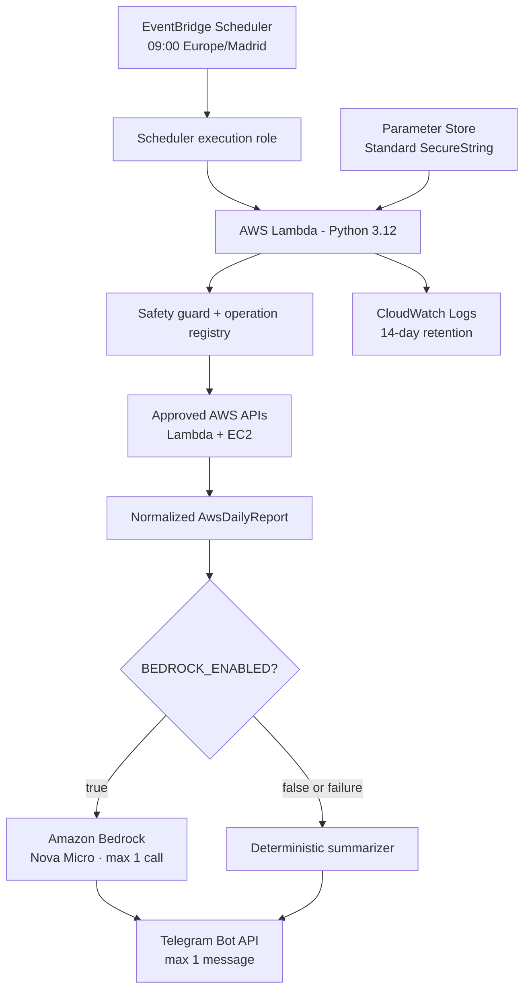

# AWS Telegram Daily Brief

[](https://github.com/herrerogusano/aws-telegram-daily-brief/actions/workflows/ci.yml)

A small, deployed serverless job that inventories a deliberately limited set of AWS resources every morning, builds a normalized operational brief, and delivers it to Telegram. It uses Python, Lambda, EventBridge Scheduler, Boto3, optional Amazon Bedrock, AWS SAM, and GitHub Actions with OIDC.

## What it does

At 09:00 in `Europe/Madrid`, one EventBridge Scheduler schedule invokes one Lambda function. The function performs approved read-only Lambda and EC2 inventory calls, normalizes the results, creates a concise summary, and sends at most one Telegram message. Amazon Bedrock Nova Micro is implemented but disabled in production; deterministic summarization is the active path.

## Runtime architecture



## Delivery architecture

```mermaid
flowchart LR
    Developer --> PR["GitHub pull request"]
    PR --> CI["CI: lint, format, typing<br/>tests, SAM validate/build"]
    CI --> Merge["Manual merge to master"]
    Merge --> CD["GitHub Actions CD"]
    CD -->|OIDC| STS["AWS STS temporary credentials"]
    STS --> DeployRole["Dedicated deployment role"]
    DeployRole --> SAM["SAM + CloudFormation"]
    SAM --> Stack["Application stack"]
```



No long-lived AWS access key is stored in GitHub. CI has no AWS credentials, and CD never invokes the application after deployment.

## Example daily brief

Synthetic example; it contains no production identifiers or account data:

```text
AWS Daily Brief - 26 Aug 2026

Status: OK
Resources detected: 3
Services checked: 2

Lambda: 1 function
EC2 networking: 1 VPC, 1 subnet

Summary: no critical collection errors detected.
```

## How it works

1. Scheduler invokes Lambda once with a fixed event.
2. Strict environment configuration is validated before external calls.
3. The operation registry classifies every reachable AWS SDK operation.
4. Collectors call only automatic `free_verified_read` operations through the safety guard.
5. SDK responses are reduced to normalized resource summaries; raw responses, account IDs, ARNs, tags, and environment variables are not propagated.
6. Bedrock is used only when explicitly enabled and enough Lambda time remains. Any Bedrock failure selects the deterministic fallback.
7. Telegram configuration is decrypted from Parameter Store in memory, and one bounded HTTPS request is attempted.
8. The handler returns a compact health result and emits sanitized structured logs.

## Reliability and observability

- A collector failure produces a partial report instead of aborting all collection.
- A Bedrock failure produces deterministic output; it does not trigger another model.
- A Telegram or secret-provider failure preserves the generated report and marks execution partial.
- Remaining-time gates avoid starting Bedrock or Telegram too close to the Lambda timeout.
- Application, Bedrock, Telegram, and Scheduler retries are zero to reduce duplicate deliveries and unexpected cost.
- CloudWatch native Lambda/Scheduler metrics and structured logs provide operational evidence; no custom metrics, alarms, DLQ, dashboard, or X-Ray resources are deployed.

Exactly-once Telegram delivery cannot be guaranteed across Scheduler, Lambda, and an external API. One schedule, zero retries, and one send per execution reduce duplicate risk but do not create an atomic transaction.

## Security

Three roles have separate responsibilities:

| Role | Purpose | Key permissions |
| --- | --- | --- |
| Lambda execution role | Run the report | Exact inventory reads, one named SSM parameter, one model-specific Bedrock permission, and its log group |
| Scheduler execution role | Trigger the job | Invoke only the target Lambda |
| GitHub deployment role | Update infrastructure | Scoped SAM/CloudFormation, artifact-bucket, Lambda, Scheduler, Logs, and project-role deployment actions |

Telegram token and chat ID live together in one Parameter Store Standard `SecureString`, encrypted with the AWS-managed SSM key. They are never stored in Git, Lambda environment variables, CloudFormation outputs, GitHub, logs, or handler responses.

## Cost controls

This is a low and bounded-cost architecture, not a "100% free" claim.

| Service | Usage pattern | Cost control |
| --- | --- | --- |
| Scheduler | 1 trigger/day | One schedule, zero retries |
| Lambda | About 30-31 runs/month | 256 MB, 60-second timeout, no provisioned concurrency |
| CloudWatch Logs | Small structured records | 14-day retention |
| Parameter Store/KMS | One config read per warm environment | Standard tier, normal throughput, AWS-managed key |
| Bedrock | 0 calls while disabled | Explicit gate, one model, max 250 output tokens, one call/run |
| S3 deployment artifacts | Packages created by CD | Private encrypted bucket, 30-day lifecycle |

Cost Explorer is intentionally absent from runtime. Potentially billable, sensitive, unknown, and write inventory operations are blocked.

## CI/CD

- Pull requests to `master`: locked dependencies, Ruff lint/format, mypy, pytest, security/IAM tests, and SAM validation/build. No AWS credentials or deployment.
- Merge to `master`: the same gates, then temporary OIDC credentials and a serialized non-interactive SAM deployment.
- CloudFormation handles change sets and rollback; empty change sets succeed.
- The deployment pipeline never sends Telegram messages or calls Bedrock.

Bootstrap infrastructure for the dedicated OIDC role and artifact bucket is declared in `infra/bootstrap/github-oidc.yaml` and is separate from the runtime stack.

## Local development

Requirements: Python 3.12 and [uv](https://docs.astral.sh/uv/). AWS SAM CLI is required only for template validation/build.

```powershell
uv sync --locked
uv run ruff check .
uv run ruff format --check .
uv run mypy
uv run pytest -q
sam validate --lint
sam build
```

Safe deterministic demo with no AWS, Bedrock, or Telegram call:

```powershell
uv run daily-brief
```

The live inventory command performs the registered AWS reads using the caller's local AWS identity, but never invokes Bedrock or Telegram:

```powershell
uv run daily-report
```

`sam local invoke` additionally requires a running Docker engine. Unit tests and the deterministic demo do not.

## Configuration

Runtime configuration names include:

- `AWS_REPORT_REGION`, `REPORT_TIMEZONE`, `LOG_LEVEL`
- `BEDROCK_ENABLED`, `BEDROCK_MODEL_ID`, `BEDROCK_MAX_OUTPUT_TOKENS`, `BEDROCK_TIMEOUT_SECONDS`
- `TELEGRAM_ENABLED`, `TELEGRAM_CONFIG_PARAMETER_NAME`, `TELEGRAM_TIMEOUT_SECONDS`

Local-only Telegram test values are documented as blank placeholders in `.env.example`. Never commit a populated `.env`.

## Deployment

Production deployments are normally performed by merging a reviewed PR into `master`. For controlled local maintenance, SAM targets the existing `aws-telegram-daily-brief` stack in `eu-west-1`; do not use `--guided` in automation and do not invoke Lambda as a deployment smoke test.

## Project structure

```text
.github/workflows/         CI and OIDC-based CD
infra/bootstrap/           GitHub deployment role and artifact bucket
src/aws_telegram_daily_brief/
  aws/                     clients, collectors, operation registry, safety guard
  llm/                     Bedrock and deterministic summarizers
  models/                  normalized report models
  notifications/           Parameter Store and Telegram boundaries
  reporting/               report builder, prompts, local CLIs
  execution.py             execution health model
  observability.py         sanitized structured logging
  handler.py               Lambda orchestration
tests/                     deterministic unit and security tests
template.yaml              SAM application stack
```

## Key design decisions

- Lambda and Scheduler fit one short daily execution better than an always-running VM or container.
- A deterministic fallback keeps delivery useful when optional generative AI is disabled or unavailable.
- Parameter Store Standard is sufficient for one low-volume secret without automatic rotation requirements.
- The runtime is independent from the interactive Exercise 2 MCP; unattended execution needs a fixed, smaller allowlist.
- GitHub OIDC and STS temporary credentials replace permanent deployment keys.

## Limitations

- Inventory coverage is intentionally limited to selected Lambda and EC2 metadata in one AWS account and region.
- S3 and CloudFormation inventory operations remain registered but blocked by sensitivity/cost policy.
- Bedrock is implemented but currently disabled in production.
- There is no persistent idempotency store or exactly-once Telegram guarantee.
- There are no CloudWatch alarms or secondary alert channel.
- Telegram remains an external delivery dependency.

## What this project demonstrates

Serverless scheduling, Lambda, Boto3 normalization, defensive IAM, Parameter Store, bounded Bedrock integration, fallback design, Telegram delivery, CloudWatch logging, SAM/CloudFormation, GitHub Actions, OIDC/STS, Python testing, and cost-aware architecture.

## What I learned

The hardest parts were not the happy-path API calls: they were deriving IAM from real operations, separating runtime and deployment identities, keeping unattended retries and costs bounded, handling partial failure explicitly, and matching GitHub's actual OIDC subject before trusting it in AWS.
